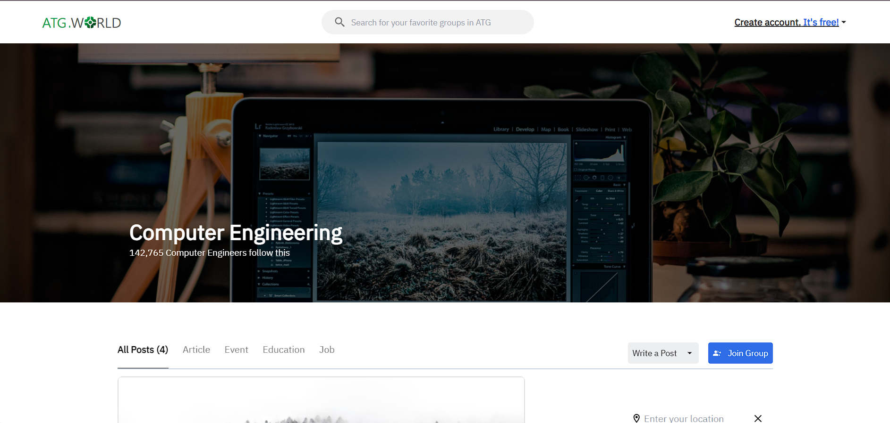
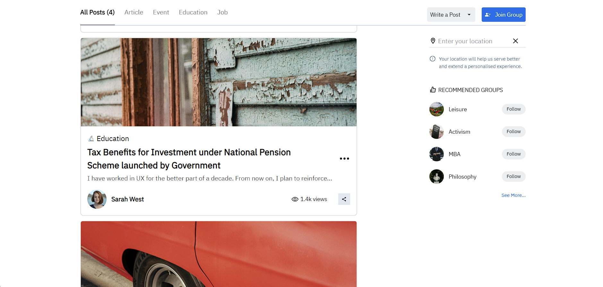
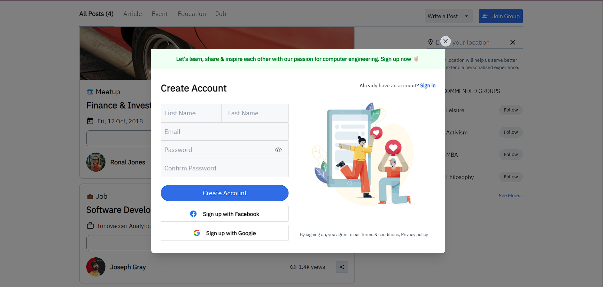

# ATGWorld Landing Page

The ATGWorld landing page, created as part of an assignment task, features a seamless and user-friendly interface. It includes a prominently placed search bar for quick content discovery, an intuitive login modal for easy authentication, and a well-organized navigation bar for efficient browsing and filtering of posts. These elements combine to provide a smooth and engaging user experience, allowing visitors to easily access and explore the content on ATGWorld.


## Tech Stack

**Client:** React, Tailwind CSS


## Demo

https://atg-world-landing-page.vercel.app/


## Installation

Install landing page with npm and GitBash

```bash
  git clone https://github.com/DebdipWritesCode/ATGWorldLandingPage.git
```

```bash
  npm install
  npm run dev
```

    
## Screenshots





